# 💰 Sistema Financeiro Pessoal

Sistema completo de gerenciamento financeiro pessoal desenvolvido com Spring Boot e React.

## 📋 Funcionalidades

- ✅ Autenticação de usuários (JWT)
- ✅ Gerenciamento de categorias (receitas e despesas)
- ✅ Registro de transações financeiras
- ✅ Dashboard com resumo financeiro
- ✅ Filtros e visualizações

## 🛠️ Tecnologias Utilizadas

### Backend
- Java 17
- Spring Boot 3.4.1
- Spring Security + JWT
- Spring Data JPA
- PostgreSQL 15
- Maven

### Frontend
- React 18
- Vite
- React Router
- Axios
- Tailwind CSS
- Context API

## 🚀 Como Executar

### Pré-requisitos
- Java 17+
- Node.js 20+
- PostgreSQL 15+
- Maven

### Backend

1. Clone o repositório
```bash
git clone https://github.com/IgorDF10/SFP.git
cd SFP/backend
```

2. Crie o arquivo `backend/src/main/resources/application-local.properties` com suas credenciais:
```properties
spring.datasource.url=jdbc:postgresql://localhost:5432/financeiro_db
spring.datasource.username=SEU_USERNAME
spring.datasource.password=SUA_SENHA
```

3. Execute o projeto
```bash
mvn spring-boot:run
```

O backend estará rodando em: `http://localhost:8080`

### Frontend

1. Navegue até a pasta frontend
```bash
cd ../frontend
```

2. Instale as dependências
```bash
npm install
```

3. Execute o projeto
```bash
npm run dev
```

O frontend estará rodando em: `http://localhost:5173`

## 📸 Screenshots

> Interface moderna e responsiva desenvolvida com React e Tailwind CSS

### 🔐 Autenticação

<table>
  <tr>
    <td width="50%">
      <h4>Tela de Login</h4>
      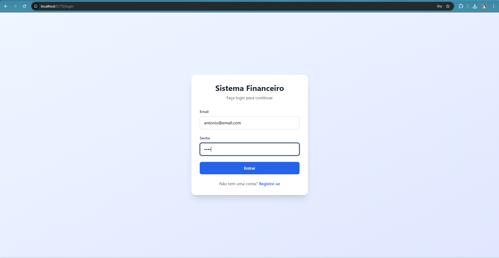
    </td>
    <td width="50%">
      <h4>Tela de Registro</h4>
      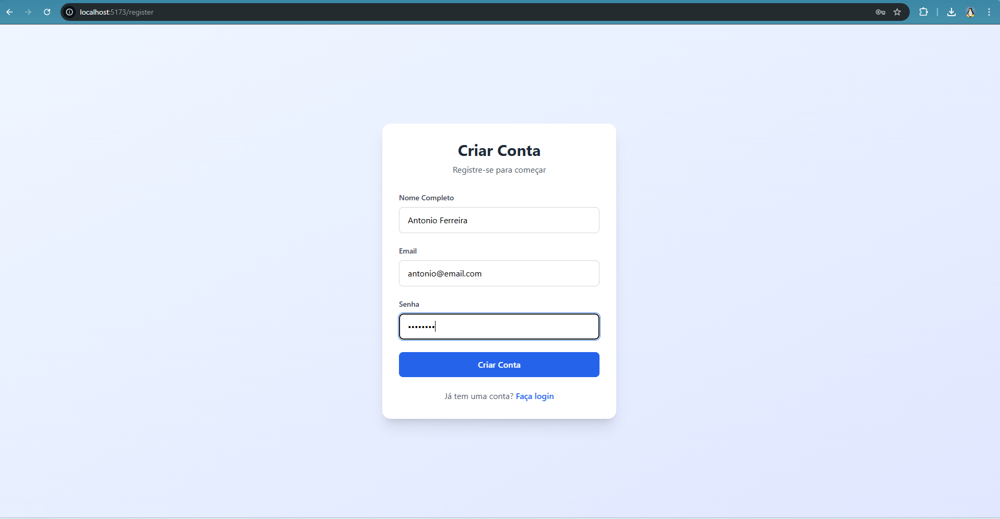
    </td>
  </tr>
  <tr>
    <td colspan="2">
      <h4>Validação de Credenciais</h4>
      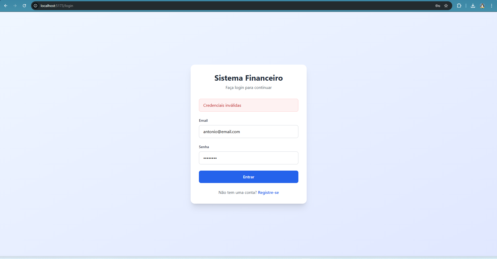
    </td>
  </tr>
</table>

---

### 📊 Dashboard

<table>
  <tr>
    <td width="50%">
      <h4>Dashboard - Estado Inicial</h4>
      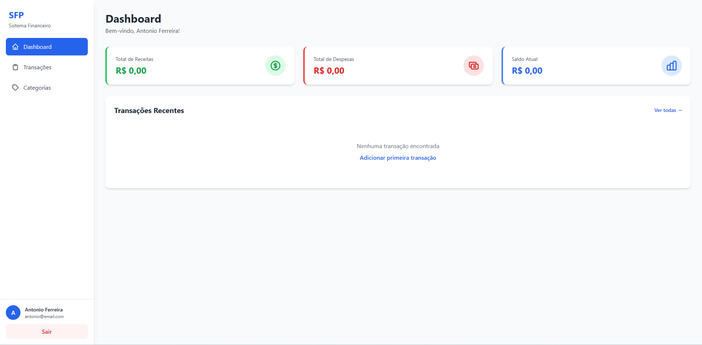
    </td>
    <td width="50%">
      <h4>Dashboard - Com Dados</h4>
      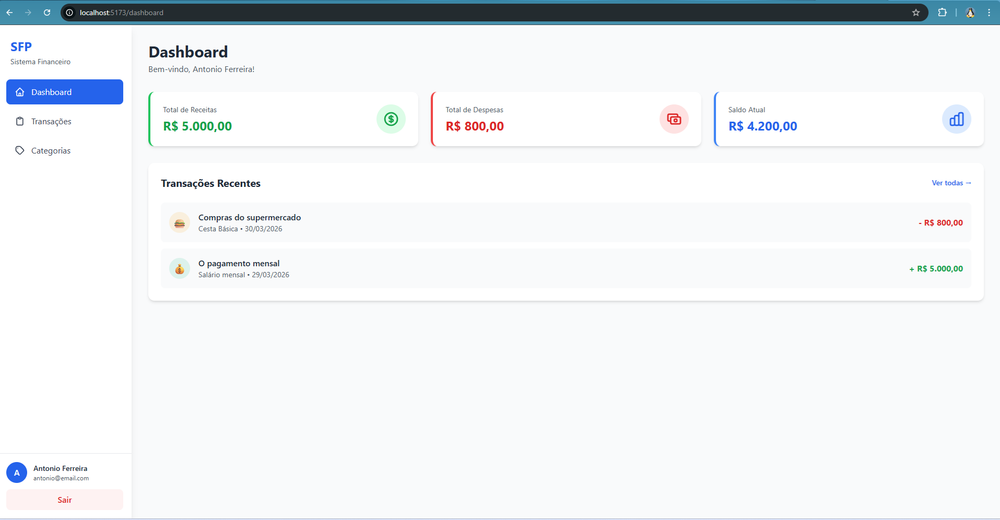
    </td>
  </tr>
</table>

**Recursos do Dashboard:**
- 📈 Cards com resumo financeiro (Receitas, Despesas, Saldo)
- 📋 Listagem de transações recentes
- 🎨 Design responsivo e moderno

---

### 🏷️ Categorias

<table>
    <tr>
    <td colspan="2">
      <h4>Listagem de Categorias</h4>
      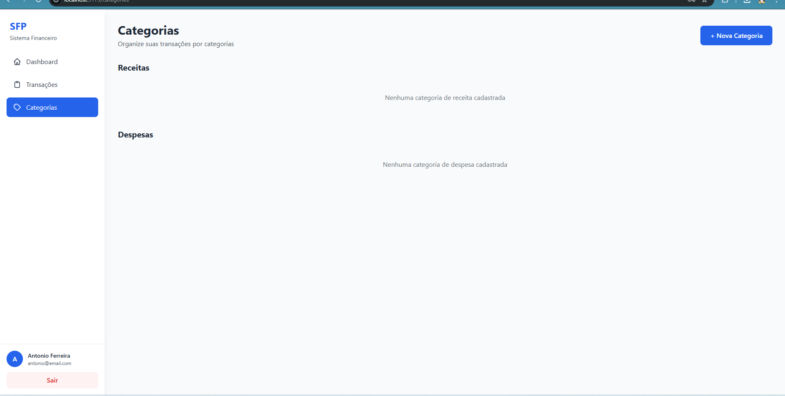
    </td>
  </tr>
  <tr>
    <td width="33%">
      <h4>Criar Categoria - Despesa</h4>
      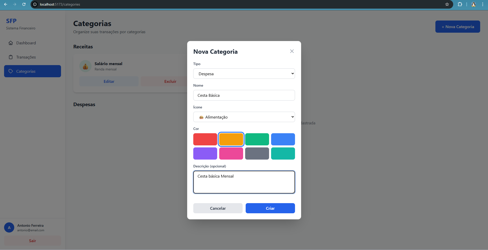
    </td>
    <td width="33%">
      <h4>Criar Categoria - Receita</h4>
      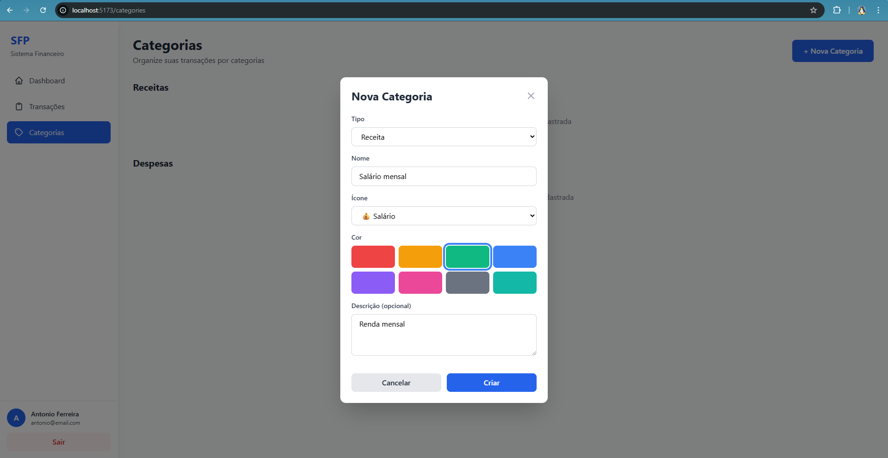
    </td>
        <td width="33%">
      <h4>Categorias - Edição</h4>
      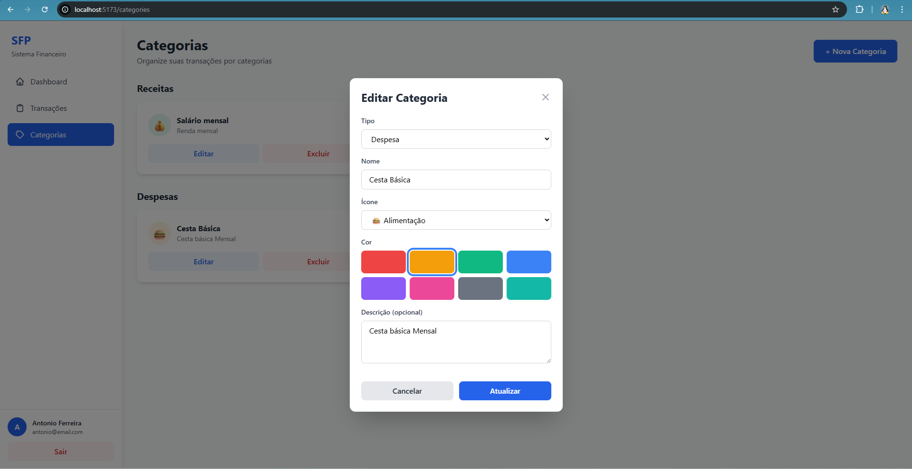
    </td>
  </tr>
</table>

**Funcionalidades:**
- ✏️ Criar, editar e deletar categorias
- 🎨 Escolher cores e ícones personalizados
- 📂 Separação por tipo (Receitas e Despesas)

---

### 💰 Transações

<table>
  <tr>
    <td colspan="2">
      <h4>Listagem de Transações</h4>
      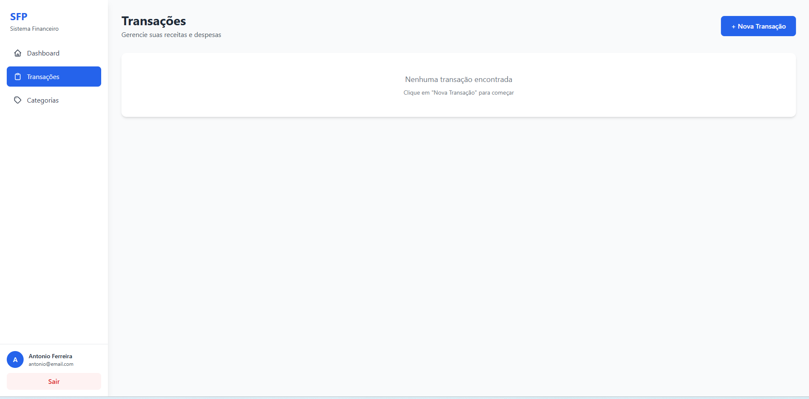
    </td>
  </tr>
  <tr>
    <td width="33%">
      <h4>Criar Transação - Despesa</h4>
      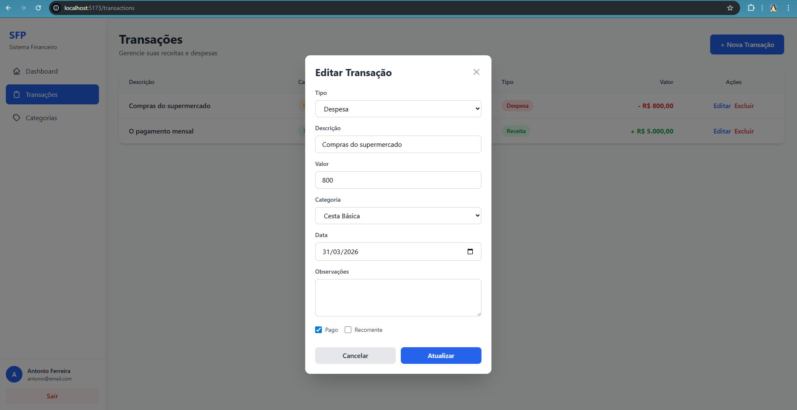
    </td>
    <td width="33%">
      <h4>Criar Transação - Receita</h4>
      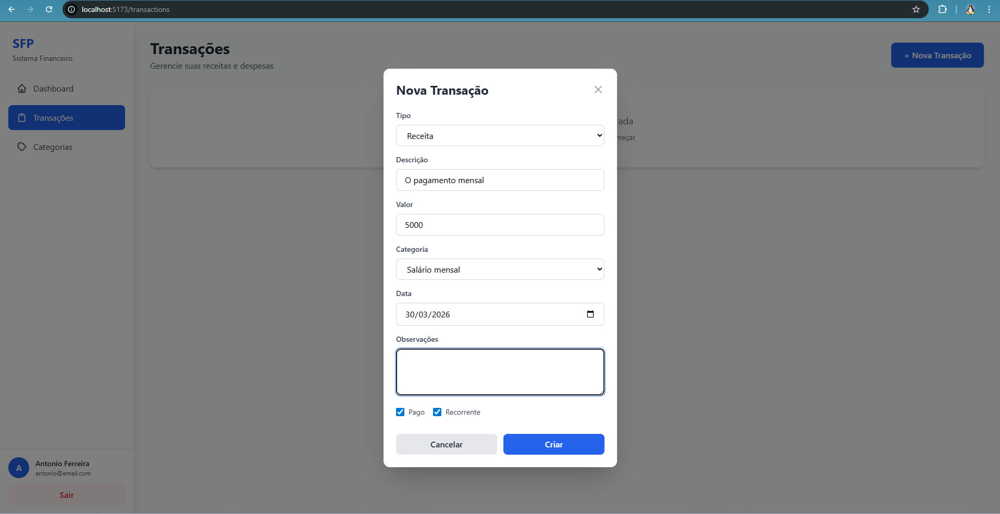
    </td>
      <td width="33%">
      <h4>Criar Transação - lista com categorias</h4>
      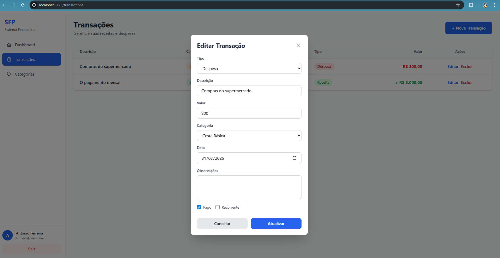
    </td>
  </tr>
    <tr>
    <td colspan="2">
      <h4>Listagem de Transações com Categorias</h4>
      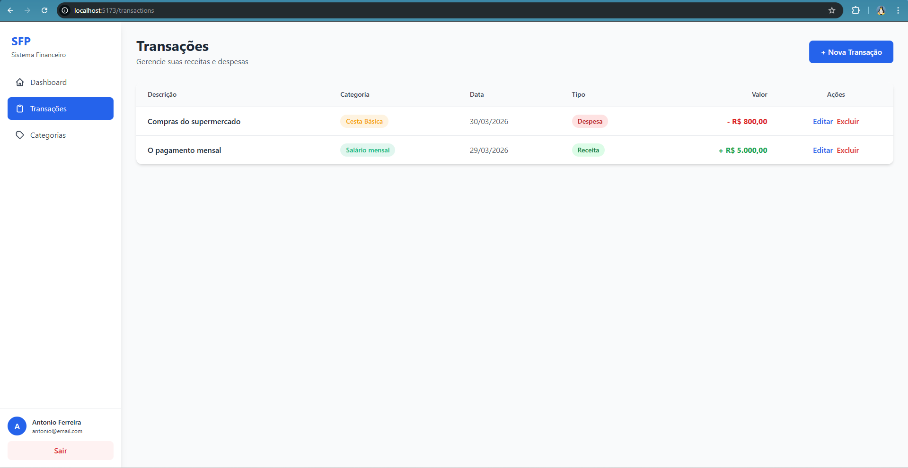
    </td>
  </tr>
</table>

**Funcionalidades:**
- 📝 Registro completo de receitas e despesas
- 🏷️ Vinculação com categorias
- 📅 Controle de datas
- ✅ Status de pagamento
- 🔁 Marcação de transações recorrentes
- ✏️ Edição e exclusão de transações

---

### 🎨 Design System

**Paleta de Cores:**
- 🟢 Verde: Receitas
- 🔴 Vermelho: Despesas
- 🔵 Azul: Saldo e elementos principais
- ⚪ Interface limpa e moderna

**Componentes:**
- 📱 Totalmente responsivo
- 🎭 Modais interativos
- 🎨 Cards coloridos por categoria
- 📊 Tabelas organizadas


## 📚 Aprendizados

Este projeto foi desenvolvido para consolidar conhecimentos em:
- Arquitetura REST API
- Autenticação JWT
- Integração Backend-Frontend
- Gerenciamento de estado com React
- Estilização com Tailwind CSS

## 👨‍💻 Autor

Igor Fernandes - [LinkedIn](https://www.linkedin.com/in/igor-fernandes-dev/) - [GitHub](https://github.com/IgorDF10)

## 📄 Licença

Este projeto está sob a licença MIT.